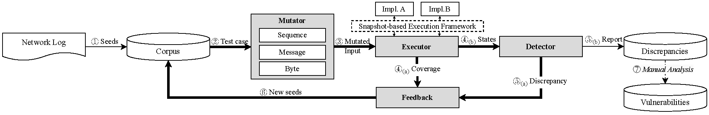

# HDHunter — A Coverage-guided Gray-box Fuzzer to Find HTTP Discrepancies

HDHunter enables gray-box fuzzing for HTTP Desync vulnerabilities. For more information, please refer to our publication.



## Setup

### Environment Requirements

- Virtualization support
- 16GB RAM minimum
- *(For compilation):* Linux OSes (Ubuntu Recommended)

### Use prebuilt VM image

We use Vagrant to setup VM. Make sure Vagrant is installed and VMware provider is available.

**Google Drive**: TBA

Before start VM, download [Vagrantfile](Vagrantfile) to current directory.

```shell
vagrant box add hdhunter.box --name hdhunter
vagrant up
vagrant ssh
```

HDHunter is built in `/hdhunter`. Refer to [Start fuzzing](#start-fuzzing) to execute the fuzzer.

### Build from scratch

Please refer to [BUILDING.md](BUILDING.md) for detailed instruction.

## Start fuzzing

### **Step 1**: Collect and convert seeds

```shell
# Here we use the example seeds in the ./example_seeds directory
./target/release/hdhunter-helper convert-input -d ./example_seeds ./corpus_initial
```

### **Step 2**: Setup target running environment

```shell
# For the first time, you need to install msgpack and jinja2 using pip
sudo pip3 install msgpack jinja2

# Take Apache HTTPd for example
TARGET=apache cargo make pack

# Enable kvm and vmware backdoor
cargo make setup-qemu
```

The target running environment will be stored in `/tmp/hdhunter-workspace/{target_name}` by default.

### **Step 3**: Run HDHunter

```shell
# Take Apache HTTPd and Apache Tomcat for example
sudo ./target/release/hdhunter-runner -1 /tmp/hdhunter-workspace/apache -2 /tmp/hdhunter-workspace/tomcat --seeds ./corpus_initial
```

The result will be stored in `./solutions`.

Use hdhunter-helper to print the input:

```shell
./target/release/hdhunter-helper print-input {path_to_input}
```

Use hdhunter-replay to replay the input:
```shell
# Take Apache HTTPd for example
sudo ./target/release/hdhunter-replay /tmp/hdhunter-workspace/apache/ {path_to_input}
```

## Citation

```bib
TBA
```